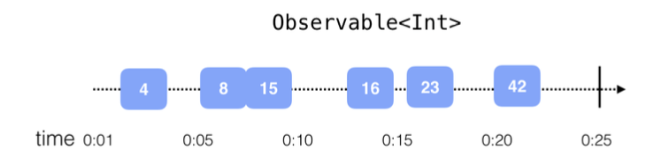
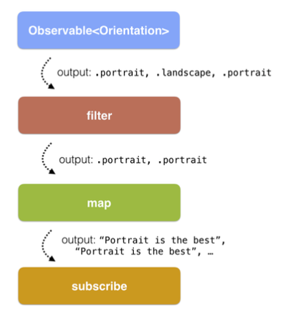
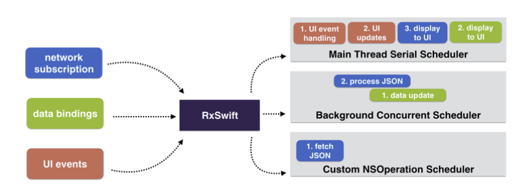
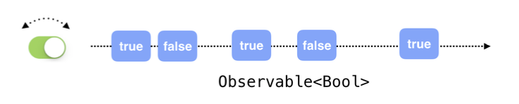

# Hello RxSwift!
```
RxSwift는 observable sequences와 functional style operatos를 사용하여 비동기와 이벤트 기반 코드를 구성하는 라이브러리이다.
```
```
RxSwift는 본질적으로 코드가 새로운 데이터에 반응하고 순차적으로 분리된 방식으로 처리함으로써 비동기 프로그램 개발을 간소화한다.
```
위 두개의 정의를 봤을 때 어쨋든 RxSwift는 비동기 코드를 작성하는데 명백하게 도움이 된다는 것을 알 수 있음.

### OK. 이제 RxSwift가 대충 뭔지 알았어. 그러면 이제 iOS에서의 비동기 프로그래밍을 봐야겠음.
* 버튼의 탭에 반응을 하는것
* 텍스트필드의 포커스가 사라졌을때 키보드가 애니메이션되는것
* 인터넷에서 용량이 큰 사진을 다운로드 하는것
* 데이터를 디스크에 저장하는것
* 오디오를 재생하는것
* 기타 등등..

위의 처리들은 모두 비동기로 처리된다는것을 알것임.(버튼을 누른다고 오디오 재생이 멈추진 않음.)

### 좀더 깊게.. Cocoa와 UIKit에서의 비동기 APIs
* NotificationCenter
* Delegate pattern
* GCD!
* Closures

뭐 위에같은것들이 있음. 이 책을 보는 사람들이면 위의 4개는 설명할 필요가 없을것같음.
분명 만들어본 앱들에도 비동기 이벤트가 많이 있었을텐데, 이들의 순서는 당연히 어떻게 실행되는지 모를테고.. 애플에서 만든 API가 훌륭하긴 한데.. 너무 쓰기 복잡함. 이 이야기는 이쯤에서 접고..

### 그럼 이제 동기코드 vs 비동기코드를 비교해봐야겠다.
* 동기코드?
```Swift
var array = [1, 2, 3]
for number in array {
    print(number)
    array = [4, 5, 6]
}
print(array)
```
위 코드를 실행시켜보면 알겠지만 블럭안에서 array를 바꾸려고해도 변하지않는다는 것을 알 수 있음. 위의 코드는 두가지를 보장함. 첫번째는 동기적인 실행이고, 두번째는 array를 반복하면서 array의 변경이 불가능 하다는것임.

* 비동기코드?
```Swift
var array = [1, 2, 3]
var currentIndex = 0
//this method is connected in IB to a button
@IBAction func printNext(_ sender: Any) {
  print(array[currentIndex])
  if currentIndex != array.count-1 {
    currentIndex += 1
  }
}
```
위 코드를 보자. 사용자가 뭔가 탭하면 배열의 현재 인덱스에 해당하는 값을 출력함.(크래쉬 발생할수도있음 조심..)
위의 코드는 두가지를 보장함. 첫번째는 비동기적인 실행이고, 두번째는 이벤트가 일어나기 전에 array의 변경 및 currentIndex의 변경이 가능하다는 것임.
즉 비동기 프로그래밍에서 핵심은
* 작업 조각이 수행되는 순서.
* 변경 가능한 데이터를 공유하는 순서.
위의 두가지가있음. 위의 두가지는 RxSwift의 강력한 기능 중 일부임.
이제 RxSwift에 대해 좀더 알아보자.

### Asynchronous programming glossary
1. State, and specifically, shared mutable state
  * State라는 것을 정의하는 것은 어려움.. 그냥 예를들면 아이폰을 사고 한..6개월정도 사용해도 하드웨어와 iOS는 동일하지만 아이폰에 설치된 수많은 앱들이며, 사용자의 로그인 기록이며.. 뭐 이러한 것들이 아이폰의 State라고 보면될거같음.
  * 이 책에선 수많은 비동기 컴포넌트들 간에 공유할 때 앱의 상태를 관리하는것을 다루게 될거임.

2. Imperative programming
 * 명령형프로그램은 아마 이책을 보기 전까지 코딩 스타일이라고 보면됨. 그냥 컴퓨터에 뭐해!뭐해!라고 명령하는것과 같음. 예를들면 `setupUI()`같은 함수를 호출하는거임.
 이러한 명령형 프로그래밍은 편리하기도한데 비동기 프로그래밍을 다루는데 쉽지 않음. 예를들어 앱의 변경할 수 있는 공유 상태가 포함된 경우임.

 3. Side effects
  * 이것도 설명할 필요가 있나싶음. 위에서 설명한 State와 엮자면 Side effects는 우리가 설정한 State의 돌연변이라고 보면될듯함.
  * 책에서 모든 프로그램의 궁극적인 목표가 side effects를 일으키는 것이라는데 잘이해가안됨(어떤 점에서는 그럴수도있을거 같기도한데 잘모르겠음).
  * 당연하겠지만 우리의 코드에서 어떤부분이 side effects를 일으키는지 쉽게 결정할 수 있어야함.

4. Declarative code
  * 선언적 프로그래밍에서는 원하는 대로 상태를 변경할 수 있음. 함수형 코드는 side effects를 일으키지 않음. RxSwift는 앞서말한 선언적코드와 함수형코드의 장점만을 갖고있음.
  * 선언적코드는 행동을 정의함. RxSwift는 특정 이벤트가 발생하면 이런 정의된 행동을 수행할 수 있음. 테스트에도 용이함.

5. Reactive systems
  * 너무 추상적인 단어라서 아래와 같은 단어로 표현함.
    * Responsive : 앱의 최신 상태를 UI에 반영함.
    * Resilient : 각 행동은 분리되어 정의되며 에러 핸들링이 유연함
    * Elastic : 코드의 다양한 작업 부화를 처리하고 종종 lazy pull-driven data collections, event throttling, and resource sharing을 구현함.
    * Message dirven : 뭐 비지니스로직과 라이프사이클을 분리하고 재사용성을 향상시키는 메시지 기반 커뮤티케이션을 한다는거임.

### Foundation of RxSwift
2009년에 마이크로소프트의 코어팀이 Reative Extension(for .Net)이라 불리는 프레임워크를 개발함. 굳굳
오늘날에 RxJS, RxKotilin, Rx.NET, RxScala, RxSwift등등 많은 언어로 만들어짐.
```
RxSwift는 전통적으로 필수적인 코코아 코드와 순수한 기능 코드 사이의 적절한 위치를 찾음. 불변의 코드 정의를 사용하여 비동기 적으로 입력 부분을 결정적이고 구성 가능한 방식으로 처리함으로써 이벤트에 대응할 수 있음.
```
Rx에 대한 내용은 [reativex](http://reactivex.io)를 참고.
소름돋는건 RxSwift의 대표 아이콘은 전기 뱀장어임.
Rx 코드의 빌딩 블럭에는 `observables`, `operators`, `scheduler`가 있음.

### Observables
얘는 그냥 간단히 생각하면됨. 제너릭 타입이고 이벤트를 발생하는 아이임. 이벤트에는 3가지 종류가 있음.
`next`, `completed`, `error` 이거 세개인데 그냥 이름이랑 딱 맞음.

<p>
<center>

</center>
</p>

위는 Int형 Observable의 예임. 앞에 글들을 생각하며 위의 그림을 잘 보면 비동기 프로그래밍의 느낌이 잘 옴.


<p>
<center>

</center>
</p>

위 그림은 observable을 observer들이 구독하는 형태라고 보면됨. observer는 observable이 발생시키는 이벤트를 구독하는 타입임. 보면알겠지만 하나의 observable에 여러개의 observer가 구독하는 형태를 취할 수도 있음.

### Operators
이거는 수학에서의 연산자 느낌이라고 보면 됨. 연산자란 어떤 식이나 값에 동작을 지시하는 부호임. 이러한 의미에서 Swift를 사용한 사람이라면 map, filter, reduce같은 연산자를 많이 보았을거임.
RxSwift에서도 위와 같은 연산자들이 있는데 이들은 이벤트라는 값에 특정 동작을 지시하는 것임.

<p>
<center>

</center>
</p>

### Schedulers
이것도 설명할필요가 있나. 단순히 생각하면 특정 동작을 스케줄링하는애임. 깊게설명하면 길어지고..
GCD의 dispatch queue라고 보면 됨.
`SerialDispatchQueueScheduler`, `ConcurrentDispatchQueueScheduler`, `OperationQueueScheduler`, `MainScheduler`등 몇개가 있음.

<p>
<center>

</center>
</p>

### App architecture
RxSwift는 MVC, MVP, MVVM등에 적용할 수 있는데 MVVM에 적용했을 때 가장 좋은것같음.
그런데 요즘엔 뭐 다양한 패턴 Redux, ReSwift등이 나오긴 했는데.. 최근나온 MVVMC가 짱인거같음.
아키텍처는 따로 공부를..

<p>
<center>

</center>
</p>

### RxCocoa
RxSwift는 단순히 Rx API의 구현인거고, 실제로 Cocoa나 UIKit에 대해서는 전혀 모름.
단순히 RxSwift만 쓰기엔 부족한게 많았을거같고.. 이래서 나온게 RxCocoa임.
RxCocoa는 Reactive기능을 Cocoa나 UIKit에 확장을 한것임.
아래는 UISwitch의 변경사항에 대한 Rx적 사고방식을 그림으로 표현함.

<p>
<center>

</center>
</p>

### Installing RxSwift
RxSwift는 cocoapods와 carthage를 지원함.

### Community
RxSwift는 [커뮤니티](http://community.rxswift.org)도 있음.