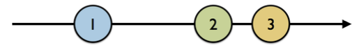
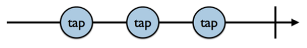
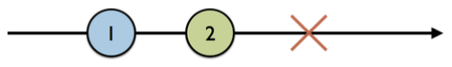
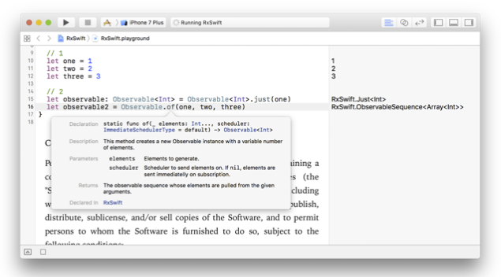
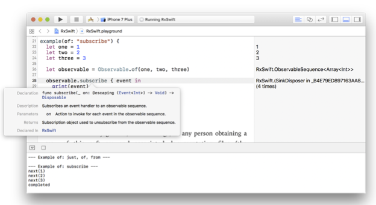
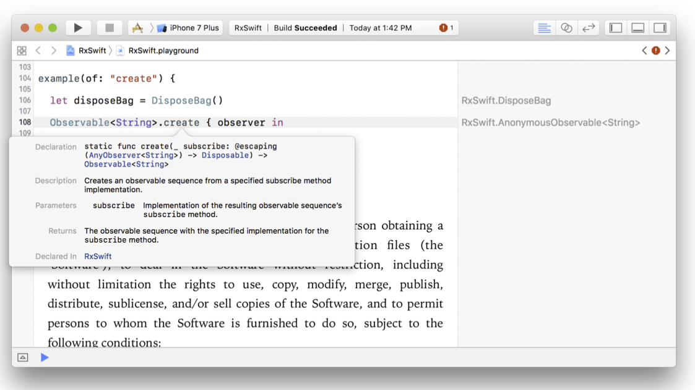

# Observables
* Observables는 Rx의 심장이다.
* 이번장에서는 이것을 어떻게 생성하고 사용하는지 배울것이다.
* observable == observable sequence == sequence == stream(RxSwift에서 이렇게 잘 안부름)
* observable은 event를 emit하는데 `비동기`라는 것을 꼭 알아야함!

그림으로 보면 아래와 같은 다이어그램이 나옴.



검은색 화살표는 시퀀스이고, `1, 2, 3` 얘네들이 이벤트임. 화살표 방향(시간의 흐름임)을 보면 알겠지만 `1`부터 emit되었음. 좀더 rx적으로 글을적는다면 `1 -> next -> 2 -> next -> 3` 요런거라고 보면 될듯함. `next`라는 이벤트도 있는데 얘는 다음 이벤트를 emit하라는 뜻임.
위 그림만으로는 `이 시퀀스의 끝이 언제지?`라는 의문이 들 수 도 있음. 그러므로 이제 Observables의 Lifecycle을 알아야겠음


위 그림은 Observable의 끝을 나타내는데, 위 그림에서 볼 수 없었던 세로 직선이 생겼음. 얘는 `completed` 이벤트라고 불리며 `더이상 해당 시퀀스에서 이벤트가 emit되지 않음. 그러므로 completed하겠어!`로 해석이 됨.


`completed` 이벤트와는 다르게 위의 빨간색 엑스표시를 보면 느끼겠지만 약간 거부감이 들긴함. 얘는 `error` event임. error 이벤트도 completed와 마찬가지로 해당 시퀀스의 마지막을 표현하는데, observable이 특정 이유로 error event를 emit한거임.

정리를 해보면 Observables의 이벤트에는 3가지가 있었음.
  * next
  * completed
  * error

```Swift
public enum Event<Element> {
    /// Next element is produced.
    case next(Element)
    /// Sequence terminated with an error.
    case error(Swift.Error)
    /// Sequence completed successfully.
    case completed
}
```
위는 이벤트에 대한 정의임.

### 다음으로 observable을 생성하는 방법에 대해서 알아봐야겠음.

```Swift
example(of: "just, of, from") {
// 1
  let one = 1
  let two = 2
  let three = 3
// 2
  let observable: Observable<Int> = Observable<Int>.just(one)
}
```
위 코드에서 알 수 있는것은
1. Integer Observable을 생성함.(타입은 Observable<Int> 임)
2. just라는 것을 통해서 `one`이라는 이벤트를 보냈음.

그러면 `just`가 뭐야? just는 observable의 타입메소드임. 즉, 해당 시퀀스에 1개의 이벤트를 보낸다는 것으로 보면됨.
계속해서 observable을 생성하는 방법을 알아볼꺼임.

```Swift
let observable2 = Observable.of(one, two, three)
```
위에서도 마찬가지로 observable을 한개 생성했음. of는 보면 알 수 있듯이 one, two, three라는 세개의 integer를 넘겼는데 of의 파라미터는 variadic parameter임.



중요한점은 얘 타입은 Observable<Int>이라는 것임. 마치 Observable[Int]로 생성될것같지만 그렇지 않음. 그러므로 이벤트는 1, 2, 3 이렇게 세개가 emit될거임. 그렇다면 [Int]로 만들기 위해선 ?

```Swift
let observable3 = Observable.of([one, two, three])
```
위와같이 하면 됨.

```Swift
let observable4 = Observable.from([one, two, three])
```
위에는 [Int]를 파라미터로 받는것을 알 수 있음. 그러나! 얘는 타입이 Observable<Int>임. 즉 배열로 파라미터를 받아서 각각 한개의 event로 emit하는거임!

### Observable을 만들고 event를 emit하는 것을 배웠음. 다음으로 배워야 할것은 ? 바로 이 event들을 subscribe하는 방법을 배울것임.

역시 코드로 보는것이 제일 좋지.
```Swift
observable.subscribe { event in
    print(event)
}
```
간단함. 특정 observable의 subscribe함수를 호출하면됨. 그러면 event를 인자로 받는 func을 정의만 하면 끝남.
위의 출력예는 아래와 같음.
```
next(1)
next(2)
next(3)
completed
```

event자체를 출력했으므로 앞에서 배운 Event의 next와 completed를 볼 수 있음.
그렇다면 next이벤트의 값은 어떻게 가져올 수 있을까? 다음과 같이 하면 됨.

```Swift
let element = event.element
```



위 사진을 보면 알겠지만 subscirbe의 리턴 타입은 `Disposable`이라는 것임. 중요함! 꼭 기억해야함(뒤에서 배움).

우리는 event를 구독하는 방법을 배웠음. 그런데 중요한 것이 특정 이벤트만 구독하고 싶을 때가 있을거임. 이럴때는 앞에서 배운 subscribe함수를 이용하면됨.

```Swift
observable.subscribe(
    onNext: { element in
        print(element)
    }, onCompleted: {
        print("completed")
    }, onError: {
        print("error")
    }
)
```

지금까지 배운것을 좀 더 정리해보면
1. next이벤트는 element를 갖고있음.
2. completed 이벤트는 element가 없음.

이번에는 `never`라는 것에 대해서 배울거임.(naver라고 읽을뻔..)

```Swift
let observable = Observable<Any>.never()
  observable
    .subscribe(
      onNext: { element in
        print(element)
    },
      onCompleted: {
        print("Completed")
    }
)
```

`never`라는 단어 뜻을 통해 유추가 되듯이. 얘를 통해 만들어진 observable은 어떠한 event를 emit하지 않음. 즉! infinite라는 뜻임! 얘는 언제쓸까...... 앞에서 Disposable이라는것을 배웠는데 사실 subscibe에는 `subscribe, onCompleted, onError`뿐 만 아니라 `onDisposed`라는 것이 있음. 뭐 아무 이벤트도 emit하지는 않지만 onDisposed를 통해서 print를 하면 찍히긴 함..

`range`라는 것을 이용해서 생성할 수도 있음.

```Swift
  let observable = Observable<Int>.range(start: 1, count: 10)
  observable
    .subscribe(onNext: { i in
      let n = Double(i)
      let fibonacci = Int(((pow(1.61803, n) - pow(0.61803, n)) / 2.23606).rounded())
        print(fibonacci)
  })
```
얘도 보면 대충 감이 옴. start가 1인 element를 10개를 내보냄(+1씩 추가되서). 얘는 Observable<Int> 타입에서만 가능함.

## Disposing and terminating
앞에서 언급한 Disposable이라는 봤었음. 얘는 subscribe의 return 타입인데, 해당 Observable Sequence를 해제하는데 필요한 거라고 생각하면 됨. 쉽게 생각해서 NotificationCenter를 통해 addObserve한 경우 이를 해제해야 이벤트를 안받게 되는 원리랑 비슷함. `completed`나 `error`이벤트를 통해서 이벤트가 더이상 오지 않는다는 것은 알지만 subscribe한 것이 종료된다는 것은 아님. 그러면 이걸 어떻게 종료할 수 있을까????????

```Swift
let observable = Observable.of("A", "B", "C")
let subscription = observable.subscribe { event in
print(event)
```

위에서 subscription은 Disposable타입인데 아래와 같이 subscribe를 해제할 수 있음.
```Swift
subscription.dispose()
```

그런데 subscription을 개별적으로 관리해야하는것이 굉장히 짜증날때가 있는데 이를 위해 RxSwift에서는 `DisposeBag`이라는 타입이 있음. 얘는 위의 Disposable을 자기 자신한테 담아두었다가 나중에 메모리에서 해재될 때 모든 구독들을 해제함.

```Swift
  let disposeBag = DisposeBag()
  Observable.of("A", "B", "C")
    .subscribe {
        print($0) }
    .addDisposableTo(disposeBag)
```
사용은 위와 같이 함.

왜 이책의 이곳에서 Observable을 만드는 얘기가 나오는지 모르겠음. 앞서 설명한 of, from, naver, range 뿐 만 아니라 특별한 Observable을 만드는 방법을 알아볼거임!

```Swift
let disposeBag = DisposeBag()
  Observable<String>.create { observer in
}
```
바로 `create`임.



create를 이용하면 원하는 모든 이벤트들을 emit하는 observable을 만들 수 있음.
사진을 보면 알겠지만 create는 특정 observer를 파라미터로 받고 Disposable을 리턴하는 타입임.

```Swift
Observable<String>.create { observer in
  // 1
  observer.onNext("1")
  // 2
  observer.onCompleted()
  // 3
  observer.onNext("?")
  // 4
  return Disposables.create()
}
```

위와같이 Observable<String>을 만들 수 있는데, create의 클로저 구현을 보면 해당 observable을 subscribe하는 다른 observer들에게 어떤 이벤트를 보낼지 정할 수 있음. 중요한것은 completed event를 보낸다는것은 이 이벤트가 emit된 이후에는 다른 어떠한 이벤트를 보낼 수 없다는 것을 의미함. 그러므로 `?`는 emit되지 않음.

```Swift
.subscribe(
  onNext: { print($0) },
  onError: { print($0) },
  onCompleted: { print("Completed") },
  onDisposed: { print("Disposed") }
)
.addDisposableTo(disposeBag)
```
위의 이벤트를 subscribe할 경우..

```
--- Example of: create ---
1
Completed
Disposed
```
위와 같이 찍히는것을 보게됨.

또한 다음과 같이 Error타입 이벤트를 emit할 수 있음.

```Swift
observer.onError(MyError.anError)
```

### Disposable이 앞에서 중요하다고 강조했는데 그 이유를 알아보자!

```Swift
  enum MyError: Error {
    case anError
  }
  let disposeBag = DisposeBag()
  Observable<String>.create { observer in
    // 1
    observer.onNext("1")
    //    observer.onError(MyError.anError)

    // 2
    //    observer.onCompleted()

    // 3
    observer.onNext("?")

    // 4
    return Disposables.create()
  }
  .subscribe(
    onNext: { print($0) },
    onError: { print($0) },
    onCompleted: { print("Completed") },
    onDisposed: { print("Disposed") }
)
//  .addDisposableTo(disposeBag)
```

```
--- Example of: create ---
1
?
```

### 위와같이 completed, error이벤트의 emit 뿐 만 아니라 Disposable을 dispose하지 않을 경우 메모리 누수가 발생하므로 주의하자!

## Creating observable factories
특정 상태에 따라 observer에게 다양한 observable을 제공하게 해주는 `deferred`라는것에 대해 알아보자.

```Swift
    let disposeBag = DisposeBag()
    // 1
    var flip = false
    // 2
    let factory: Observable<Int> = Observable.deferred {
        // 3
        flip = !flip
        // 4
        if flip {
            return Observable.of(1, 2, 3)
        } else {
            return Observable.of(4, 5, 6)
        }
    }
    
    for _ in 0...3 {
        factory.subscribe(onNext: {
            print($0, terminator: "")
        }).addDisposableTo(disposeBag)
        
        print()
    }
```

위 코드를 보면 클로저 내부에서 flip에 따라 다른 observable을 생성하는것을 볼 수 있음. 앞서 많은것을 배웠기 때문에 위의 코드를 보면 다 이해 할것이라고 생각함.

위의 출력은 아래와 같음.
```
--- Example of: deferred ---
123
456
123
456
```