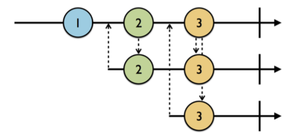
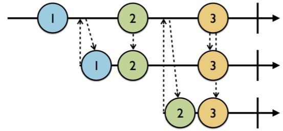
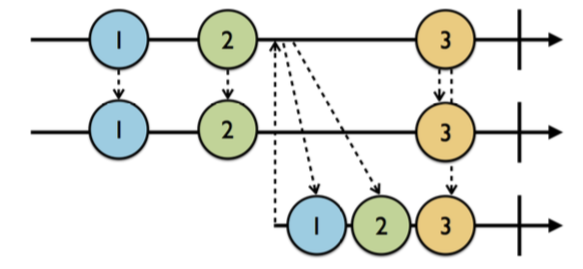

# Subject
이번장에서는 이벤트를 방출하고 이를 구독할 수 있는 `Subject`라는 것에 대해서 배울것임.
`Subject`에는 크게 3가지 종류가 있음.
  * PublishSubject
  * BehaviorSubject
  * ReplaySubject

위의 3개 말고도 `BehaviorSubject`를 한번 랩퍼한 `Variable`이라는 것도 있음. 이제 이것들에 대해서 하나하나 파헤쳐 볼것임.

## PublishSubject
`PublishSubject`는 구독자가 구독한 시점으로부터 이벤트를 받을 수 있게 하기위해 사용할 때 유용함. 중요한것은 `complete` 혹은 `error` 이벤트가 발생되기 이전까지만 받을 수 있음(요건 앞장에서 말함!).
아래 그림을 보면 쉽게 이해할 수 있음.



검은색 화살표가 구독자가 구독하는것을 의미하고, 점선 화살표가 해당 구독 시점을 의미함.
2번째는 2번부터 3번째는 3번부터 받는것을 볼 수 있는데 이는 `구독시점으로부터 발생한 이벤트만을 받는것`을 의미함.

## BehaviorSubject
얘는 동작은 PublishSubject와 같은데 중요한 차이점이 한가지가 있음! `발생한 이벤트 중 마지막 이벤트를 한개를 기억`한다는 중요한 특징이 있다. 그림을 보자!



PublishSubject와는 다르게 2번째 구독자는 구독시점 이전에 발행된 1번 이벤트에 대해서 받을 수 있다는 것임.
3번째 것을 보면 BehaviorSubject가 무엇을 하는지 확실히 이해할 수 있는데, 3번째 것은 구독시점을 기준으로 2번 이벤트와 3번 이벤트를 받는것을 볼 수 있음.
종합해서 정리하면 2번째와 3번째 시퀀스를 통해서 BehaviorSubject는 `발생한 이벤트 중 마지막 이벤트를 한개를 기억`한다는 것을 알 수 있다!

```
집고 넘어가자! 그러면 BehaviorSubject는 언제사용하느냐!
음.. 어느 구독 시점이 이벤트 발행시점보다 느린데 default initial value를 반드시 구독해야 하는 경우! PublishSubject보다는 이 BehaviorSubject를 사용하는것이 더 의미있을 수 있음!
```

## ReplaySubject
앞서 말한 BehaviorSubject의 동작을 확실히 이해했다면 이 Subject의 동작을 이해하는데 별 문제가 없을것임.
BehaviorSubject는 단 1개의 마지막 이벤트만을 기억한다는 특징이 있었는데 ReplaySubject는 `특정 갯수 만큼의 마지막 이벤트를 기억`할 수 있는 특징을 갖고있음. 1개던..2개던..3개던 버퍼의 크기만큼 마지막 이벤트를 기억할 수 있음!!



이해만 잘 했다면 위의 그림은 한방에 이해될것임.. 참고로 얘는 에러 이벤트도 기억함.. 그러므로 에러 이벤트가 발생했을 때는 앞서배운 dispose를 통해서 시퀀스를 해제해자!

## Variable
앞서 잠깐 말했는데 `Variable`은 `BehaviorSubject`를 한번 감싼 클래스임. 얘는 특정 이벤트의 엘리먼트(Value) 한개를 저장할 수 있음. 저장된 value는 Variable의 value라는 프로퍼티를 통해서 접근할 수 있으며, 앞서 다른 Subject는 다음 이벤트를 보내기 위해 `onNext()`라는 함수를 호출했는데, 얘는 value에 다른 value를 초기화시키면 자동으로 onNext()가 호출됨.
또한 생성할 때 반드시 default initial value를 갖고있어야 함.
중요한 사실중 한가지는 `error이벤트를 발생시키지 않는다는 것`임!
에러를 발생시키기 위해선 아래와 같이 사용해야 함.

```Swift
// These will all generate errors
variable.value.onError(MyError.anError) //  event type이 error
variable.asObservable().onError(MyError.anError)    //  observable 타입으로 변환
variable.value = MyError.anError    //  event type이 error
variable.value.onCompleted()        //  event type이 error
variable.asObservable().onCompleted()   //  Observable 타입으로 변환
```
