# Filtering Operators
초고층 빌딩을 세우기 위해 기반을 탄탄히 하는것처럼 RxSwift를 배우는 과정 또한 빌딩을 짓는것처럼 기반을 탄탄히 잡아야함!
이번 장에서는 `filtering operators`에 대해서 배울것임! 특정 조건에 따라 이벤트를 구독할지 말지 정하는것임!

## Ignoring operators

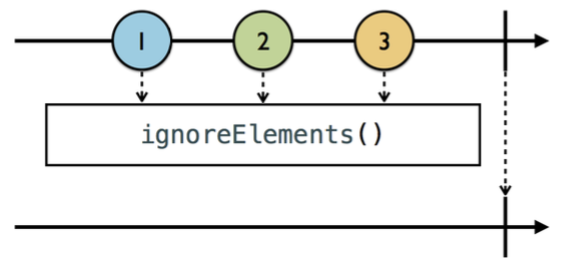

`ignoreElements()`는 `next`이벤트를 무시하고 `정지 이벤트(completed, error)`만 받게 하는 Operator임.

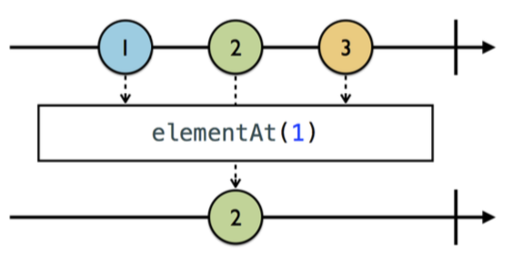

`elementAt`은 next 이벤트 중 특정 Index의 이벤트를 구독하는것임 !

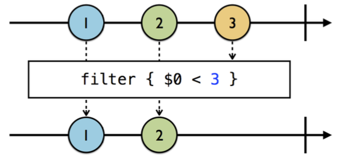

`filter`는 Swift를 사용하는 우리에게 굉장히 익숙한 Operator임. 특정 조건에 만족하는 이벤트만 구독하는것임!

## Skipping operators

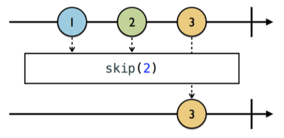

`skip`은 이벤트 몇개를 skip한 다음 그 이후 이벤트만 구독하는것임!

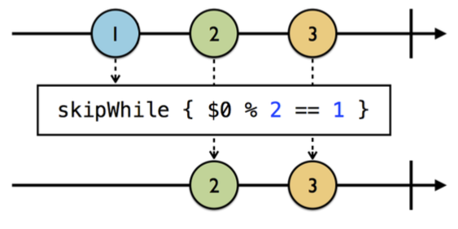

`skipWhile`은 특정 조건을 만족하지 않는 이벤트를 받을 때까지 skip하는것임! 즉, 이벤트 구독 시점으로부터 받는 모든 이벤트가 skipWhile의 특정 조건을 만족하면 계속 skip되는것임!

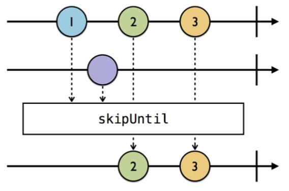

`skipUntil`은 관찰 가능한 다른 시퀀스의 이벤트가 방출될 때 까지 해당 시퀀스로부터 오는 모든 이벤트를 skip하는것임!

## Taking operators

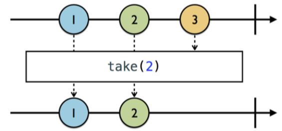

`take`는 skip과 반대로 특정 이벤트 몇개만 구독하는것임!

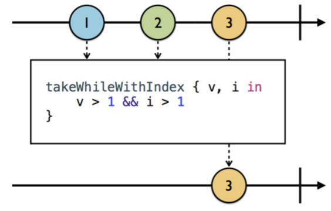

`takeWhileWithIndex`는 특정 조건을 만족하는 연속적인 이벤트를 구독하는데, 구독 이후 조건에 만족하지 않는 이벤트 이후에 받는 모든 이벤트는 무시된다! 다음에 나오는 `takeUnil`과는 차이점은 이벤트의 `index`를 같이 알 수 있다는 것이다!

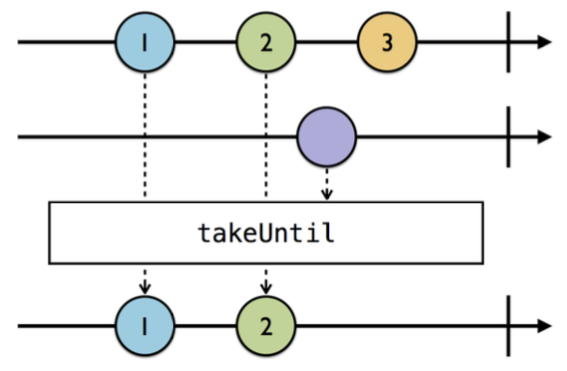

`takeUntil`은 특정 조건을 만족하는 연속적인 이벤트를 계속해서 구독하는 것임! 마찬가지로 조건을 만족하지않는 이벤트를 만나면 이후의 이벤트는 모두다 무시된다!

## Distinct operators

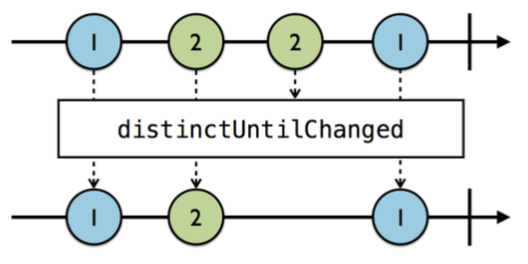

`distinctUntilChanged`는 이벤트 구독 중 이전에 받은 이벤트와 같은 element를 갖는 이벤트의 경우 구독을 무시하는것임!

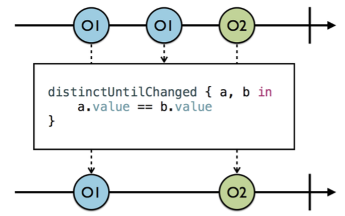

`distinctUntilChanged`는 위와같이 복합 객체에 대해서 처리가 필요한 경우도 있는데, 해당 이벤트의 element가 `Equatable` 프로토콜을 구현했을 경우 조건 로직을 클로저로 정의할 필요가 없지만, 때에 따라 조건 로직을 클로저로 구현이 필요할 때 사용함!

